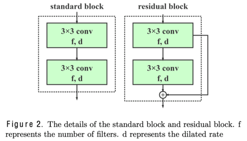

# PDR-UNet Paper Implementation using PyTorch

## Table of Contents

+ [About](#about)
  + [Dataset](#dataset)
  + [Architecture](#architecture)
  + [UNet vs. PDR-UNet Architecture](#compare)
+ [Getting Started](#getting_started)
  + [Directory Structure](#dir_str)
  + [Prerequisites](#prereq)
+ [Installing the Requirements](#installing)
+ [Running the Code](#run_locally)
+ [Segmenting Images Selected Randomly from Dataset](#predict)
+ [TODO](#todo)
+ [A Kind Request](#request)
+ [License](#license)

## About <a name="about"></a>

_Checkout the [blog](https://ajaystar8.github.io/portfolio/portfolio-1/) of this project on my website!_

_An unofficial implementation of Pure Dilated Residual U-Net architecture as proposed in [Shen et al.](https://www.aimsciences.org/article/doi/10.3934/ipi.2020057)_

A personal project created with an aim to experiment with different semantic segmentation architectures proposed in relevant research papers and reproducing results using custom datasets.

Implementation of the `Pure Dilated Residual U-Net` (PDR-UNet) architecture as described in [Shen et al.](https://www.aimsciences.org/article/doi/10.3934/ipi.2020057) for the task of semantic segmentation of Humerus Bone using X-Ray images as the input modality. 

Reproduction of results is carried out using a subset of the [MURA](https://stanfordmlgroup.github.io/competitions/mura/) dataset.

The main code is located in the [train.py](train.py) file. All other code files are imported into the [train.py](train.py) file for training and testing the model. 

The code to perform segmentation on custom images is present in [predict.py](predict.py) file. 

### Dataset <a name="dataset"></a>

The images obtained from [MURA](https://stanfordmlgroup.github.io/competitions/mura/) had the X-Ray images included, without the ground truth segmentation masks. 

Hence, ground truth annotations were created using the [LabelMe](https://github.com/labelmeai/labelme.git) software. The created masks were later validated by medical professionals.

### Architecture <a name="architecture"></a>

The proposed model is an end-to-end trainable network for automatic segmentation for biomedical semantic segmentation tasks.

PDR-UNet exploits the inherent advantages of the skip connections (as used in the [UNet](https://github.com/ajaystar8/UNet-PyTorch/blob/main/model_builder.py) architecture), residual blocks (as used in the [ResNet](https://arxiv.org/abs/1512.03385) architecture) and dilated convolutions (as proposed in [Yu et al.](https://arxiv.org/pdf/1511.07122)) to capture rich context information and offer robust bone structure segmentation.

The proposed network diagram as in [Shen et al.](https://www.aimsciences.org/article/doi/10.3934/ipi.2020057) is shown below.




### UNet vs. PDR-UNet Architecture <a name="compare"></a>

PDR-UNet architecture uses UNet as its backbone architecture. However, there are certain architectural changes made to UNet backbone to implement  PDRU-Net, which makes this new and modified architecture more suitable and effective at capturing the minute boundaries, which are quite common in medical imaging datasets. 

Here are the major differences between the two architectures:
1. `Building Blocks`: Unlike UNet where just convolutional blocks are employed, PDR-UNet is a combination of both standard convolutional and residual blocks.
2. `Encoding Network`: In UNet, MaxPooling is used as the down-sampling strategy in the encoder network. However, PDR-UNet utilizes dilated convolutions. Dilated convolutions increase the receptive field of the network without down-sampling. Even though MaxPooling has a simpler implementation and is computationally more efficient, it may lose fine-grained information due to down-sampling. 
3. `Decoding Network`: As Dilated convolutions do not cause down-sampling, the input image dimensions remain the same throughout the architecture. Hence, PDR-UNet does not employ any up-sampling strategy. However, this is not the case with UNet, and hence it employs Transposed convolutions as its up-sampling strategy.
4. `Training Parameters`: In UNet, the number of training parameters grows exponentially due to the need of doubling the number of filters after each MaxPooling layer. A typical classical UNet has about 33M training parameters! However, due to dilated convolutions in PDR-UNet, the number of filters remains constant throughout the architecture, hence resulting to just about 0.36M training parameters!

## Getting Started <a name="getting_started"></a>

These instructions will get you a copy of the project up and running on your local machine.

### Project Structure <a name="dir_str"></a>
The project is structured as follows:
```
UNet-PyTorch/
├── assets/
├── config/
│   ├── __init__.py
│   └── private_keys.py
├── data/
│   ├── train/
│   │   ├── images/
│   │   └── masks/
│   ├── val/
│   │   ├── images/
│   │   └── masks/
│   └── test/
│       ├── images/
│       └── masks/
├── models/
├── requirements.txt
├── utils.py
├── data_setup.py
├── model_builder.py
├── engine.py
├── train.py
└── predict.py
```
Ensure that your directory structure abides by the structure mentioned above. 
Especially, make sure your data folder is structured in the format mentioned above. For your reference, an empty `data` directory following this structure is placed in this project.

### Prerequisites <a name = "prereq"></a>

You need to have a machine with Python > 3.6 and any Bash based shell (e.g. zsh) installed:

```ShellSession
$ python3.8 -V
Python 3.8.18

$ echo $SHELL
/bin/zsh
```

## Installing the Requirements <a name="installing"></a>

Clone the repository: 
```ShellSession
$ git clone https://github.com/ajaystar8/PDRUNet-PyTorch.git
```

Install requirements using in a new conda environment:
```ShellSession
$ conda create -n name_of_env python=3.8 --file requirements.txt
```

## Running the Code <a name="run_locally"></a>

Activate the conda environment:
```ShellSession
$ conda activate name_of_env
```

Command invocation help to begin model training. An example command invocation is given below. 
```console
$ python3 train.py --help
>>> usage: train.py [-h] [-v VERBOSITY] [--input_dims H W] [--epochs NUM_EPOCHS] [--batch_size N] [--learning_rate LR] [--in_channels IN_C]
                [--out_channels OUT_C] [--filters F]
                DATA_DIR CHECKPOINT_DIR RUN_NAME DATASET_NAME WANDB_API_KEY

Script to begin training and validation of PDRU-Net.

positional arguments:
  DATA_DIR              path to dataset directory
  CHECKPOINT_DIR        path to directory storing model checkpoints
  RUN_NAME              Name of current run
  DATASET_NAME          Name of dataset over which model is to be trained
  WANDB_API_KEY         API key of your Weights and Biases Account.

optional arguments:
  -h, --help            show this help message and exit
  -v VERBOSITY, --verbose VERBOSITY
                        setting verbosity to 1 will send email alerts to user after every epoch (default: 0)

Hyperparameters for model training:
  --input_dims H W      spatial dimensions of input image (default: [256, 256])
  --epochs NUM_EPOCHS   number of epochs to train (default: 10)
  --batch_size N        number of images per batch (default: 1)
  --learning_rate LR    learning rate for training (default: 0.0001)

Architecture parameters:
  --in_channels IN_C    number of channels in input image (default: 1)
  --out_channels OUT_C  number of classes in ground truth mask (default: 1)
  --filters F           number of filters in architecture (refer architecture diagram) (default: 40)

Happy training! :)
```

Example command invocation to begin training the PDR-UNet architecture. Change the arguments as necessary. 
```ShellSession
$ python3 train.py --verbose 0 --input_dims 128 128 --epochs 10 --batch_size 1 --learning_rate 1e-4 --in_channels 1 --out_channels 1 --filters 40 path/to/data path/to/models my_run_name my_dataset_name 123abc
```

## Segmenting Images Selected Randomly from Dataset <a name="predict"></a>
Once the model training is complete and the .pth file is stored in the models directory, you can execute this script. Similar to [train.py](train.py), command line arguments can be specified to alter the model behaviour accordingly. 

Command invocation help to perform image segmentation. An example command invocation is given below. 
```console
$ python3 predict.py --help
>>> usage: predict.py [-h] [--input_dims H W] [--in_channels IN_C] [--out_channels OUT_C] [--filters F] data_dir checkpoint_dir

Script to segment an image using a trained checkpoint of PDRU-Net.

positional arguments:
  data_dir              path to dataset directory
  checkpoint_dir        path to directory storing model checkpoints

optional arguments:
  -h, --help            show this help message and exit
  --input_dims H W      spatial dimensions of input image (default: [256, 256])
  --in_channels IN_C    number of channels in input image (default: 1)
  --out_channels OUT_C  number of classes in ground truth mask (default: 1)
  --filters F           number of filters in architecture (refer architecture diagram) (default: 40)

Happy segmenting! :)
```

Example command invocation to begin segmentation using PDR-UNet architecture. Change the arguments as necessary.
```ShellSession
$ python3 predict.py path/to/data path/to/models --input_dims 128 128 --in_channels 1 --out_channels 1 --filters 40
```

## TODO <a name="todo"></a>

Read the [TODO](TODO.md) to see the current task list. 

## A Kind Request <a name="request"></a>

I have tried to adopt good coding practices as mentioned in different blogs and articles. 
However, I feel there is still a lot of room for improvement in making the code more efficient, 
modular and easy to understand.

I would be thankful if you could share your opinions by opening a GitHub Issue for the same. Your
criticisms are always welcome! 


## License <a name = "license"></a>

This project is licensed under the Apache License - see the [LICENSE](LICENSE) file for details.
